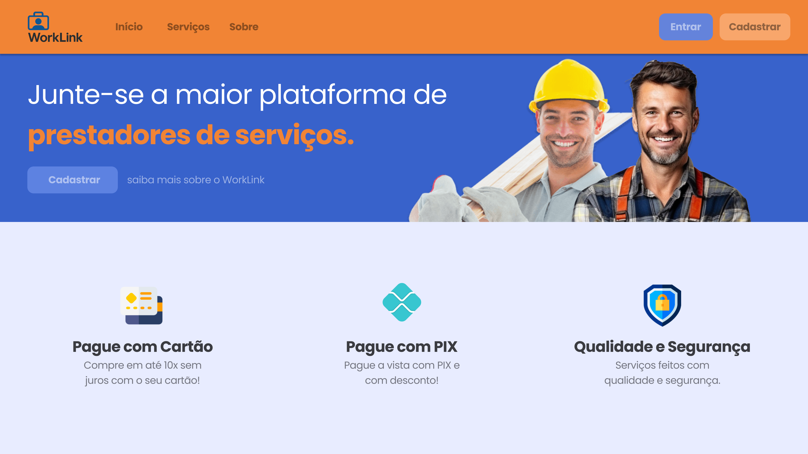
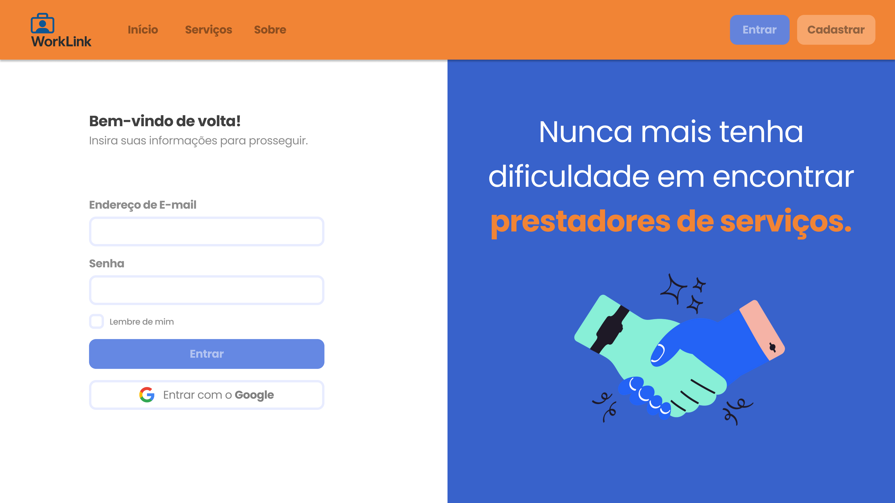
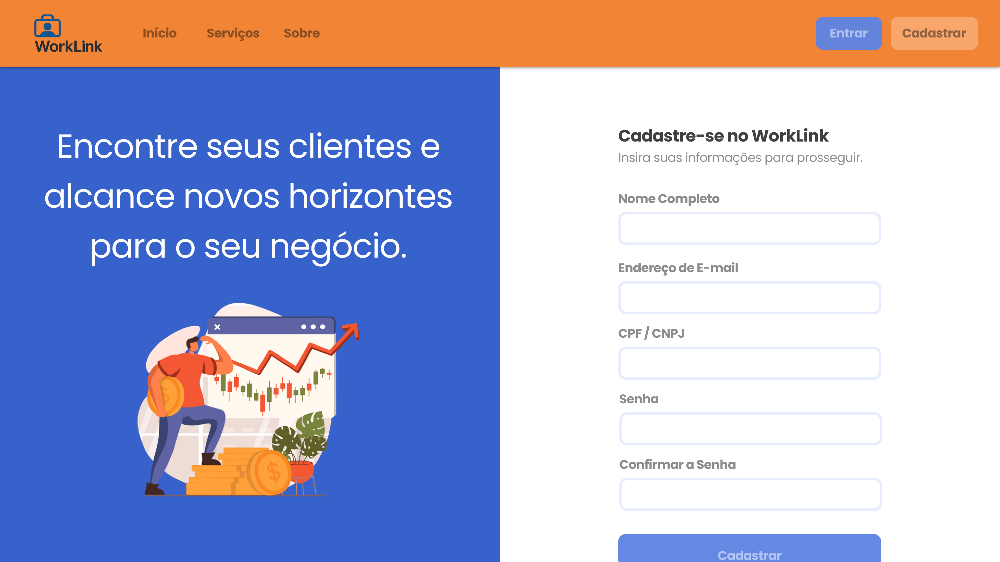
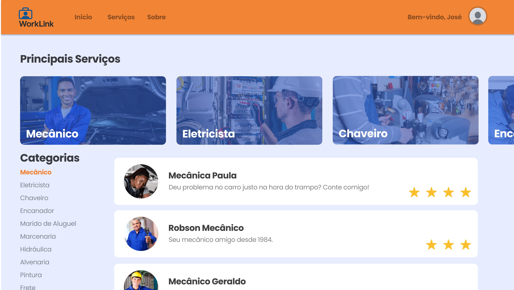
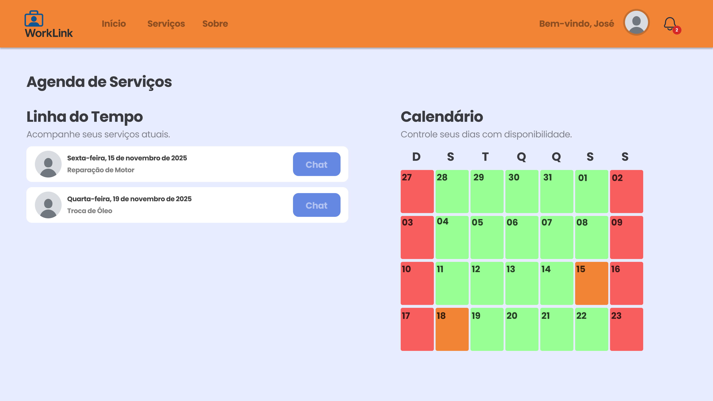
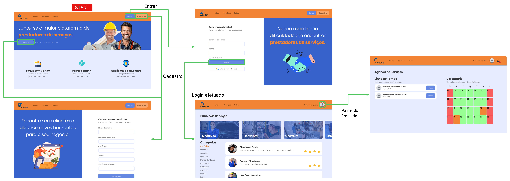

# Projeto de Interface

Visão geral da interação do usuário pelas telas do sistema e protótipo interativo das telas com as funcionalidades que fazem parte do sistema (wireframes).

# Landing

A página de Landing foi elaborada com o propósito de ser chamativa e atrativa, apresentando o WorkLink, o seu propósito e características.
Atende os requisitos não funcionais RNF-001 mediante responsividade e o RNF-004, mediante acessibilidade e fácil compreensão.

# Login

A pagina de Login foi elaborada de forma simples, buscando não ser invasiva ao usuário e solicitando apenas as informações necessárias para acessar a plataforma.
Não há funcionalidade, porém busca atender os requisitos não funcionais RNF-002	mediante criptografia e o RNF-005	mediante a realização de requisiçoes de forma rápida e eficiente.

# Registro

A pagina de Registro/Cadastro foi elaborada para não solicitar tantas informações do usuário, visto que isso poderia ser exaustante e frustrante para o mesmo. Portanto, o cadastro é um só para ambos prestadores de serviços e clientes, com o cadastro de Prestador de Serviços sendo facultativo adiante na plataforma.

# Serviços (Página Principal)

A pagina de Serviços foi elaborada para auxiliar o usuário a buscar exatamente o serviço o qual procura, portando categorias de fácil compreensão e acesso, permitindo a indexação dos tipos de serviços disponíveis.

# Painel do Prestador

O painel do prestador foi elaborado com o prestador em mente, portando ferramentas para auxiliar a sua comunicação com seus clientes e organização de seu trabalho.

## User Flow

## Wireframes

São protótipos usados em design de interface para sugerir a estrutura de um site web e seu relacionamentos entre suas páginas. Um wireframe web é uma ilustração semelhante do layout de elementos fundamentais na interface e é fundamental sempre relacionar cada wireframe com o(s) requisito(s) que ele atende.

### Exemplo

A tela inicial exibe uma barra de navegação superior com dois botões, sugerindo funcionalidades como envio de conteúdo ou acesso a uma galeria. Abaixo, à esquerda, destaca-se um título em português ("espaço reservado para o texto de título") acompanhado por um botão de ação ("Botão persuasivo") e um link ("link para mais informações"). À direita do título, um espaço reservado para uma imagem é indicado por um ícone de paisagem com uma figura humana. A parte inferior da tela é dividida em duas seções retangulares com títulos em português: "FeedBack de Usuários" à esquerda e "Upgrades e Updates" à direita. Um menu lateral com três itens ("Menu Item 1", "Menu Item 2", "Menu Item 3") está posicionado no canto superior esquerdo, abaixo de um espaço reservado para um logo.

 
> **Links Úteis**:
> - [Protótipos vs Wireframes](https://www.nngroup.com/videos/prototypes-vs-wireframes-ux-projects/)
> - [Ferramentas de Wireframes](https://rockcontent.com/blog/wireframes/)
> - [MarvelApp](https://marvelapp.com/developers/documentation/tutorials/)
> - [Figma](https://www.figma.com/)
> - [Adobe XD](https://www.adobe.com/br/products/xd.html#scroll)
> - [Axure](https://www.axure.com/edu) (Licença Educacional)
> - [InvisionApp](https://www.invisionapp.com/) (Licença Educacional)
